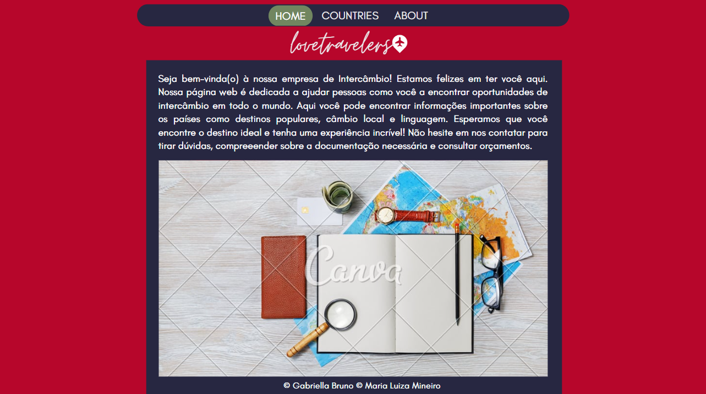
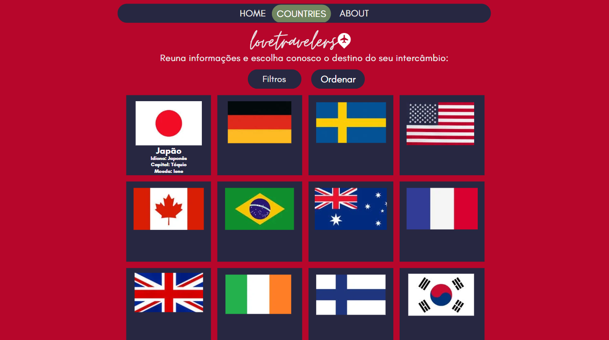
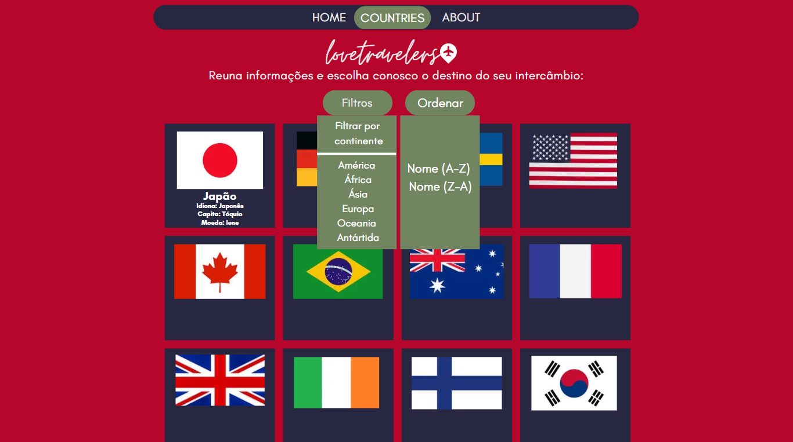
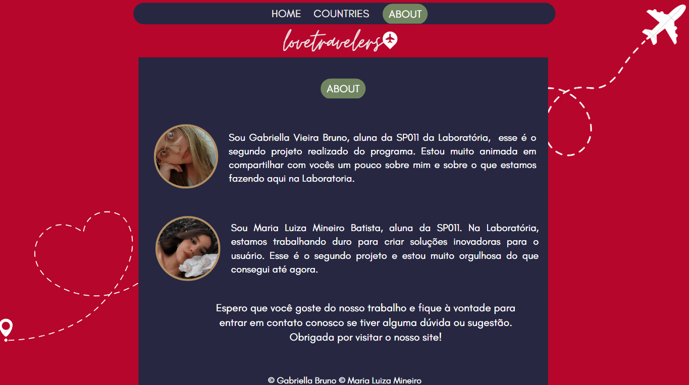

# Data Lovers

Adicionar imagem de capa.

## Índice

* [1. Descrição do Projeto](#1-descrição-do-projeto)
* [2. Status do Projeto](#2-status-do-projeto)
* [3. Funcionalidades e Demonstração da Aplicação](#3-funcionalidades-e-demonstração-da-aplicação)
* [4. Acesso ao Projeto](#4-acesso-ao-projeto)
* [5. Tecnologias utilizadas](#5-tecnologias-utilizadas)
* [6. Desenvolvedoras](#6-desenvolvedoras)

***

## Protótipo de Baixa Fidelidade 

## Protótipo de Alta Fidelidade 

## 1. Descrição do Projeto

Para este projeto trazemos uma série de dados de Países, de modo que o usuário consiga verificar as informações pertinentes para o seu processo de intercâmbio. 

Ao analisar diversas histórias de usuário tivemos um grande índice de estudantes que têm a finalidade de realizar um intercâmbio, mas que estão com opções em aberto, bem como não conseguem achar em um único local todas as informações necessárias e é pensando nesse tipo de usuário que criamos e desenvolvemos o lovetravelers, nosso site de intercâmbio. 

Levamos em consideração a história de nossa usuária, a qual descreve: “Como uma estudante de intercâmbio, eu quero pesquisar programas de intercâmbio em diferentes países, e informações deles, para encontrar o melhor destino para mim”.

Para isso, nessa interface, ela pode verificar todas as informações relevantes e seus critérios de aceitação como língua falada, capital, população e continente que o país pertence, tornando assim seu processo de intercâmbio cada vez mais fácil. 

Como entregavél final teremos uma página web que permite visualizar dados dos países do mundo, filtrá-los, ordená-los e fazer cálculo agregado. 

## 2. Status do Projeto 

Em desenvolvimento. 

## 3. Funcionalidades e Demonsrtração da Aplicação

Aqui colocar os problemas de usabilidade que tivemos. 

## 4. Acesso ao Projeto 

Colocar o link do projeto aqui. 

## 5. Tecnologias Utilizadas
HTML | CSS | JavaScript
## 6. Desenvolvedoras
**Gabriella Vieira Bruno** [LinkedIn](https://www.linkedin.com/in/gabriellavieirabruno/) | [GitHub](https://github.com/Gabsvb1)

**Maria Luiza Mineiro Batista** [LinkedIn](https://www.linkedin.com/in/maria-luiza-mineiro-batista-27897b216) | [GitHub](https://github.com/malumineiro)
